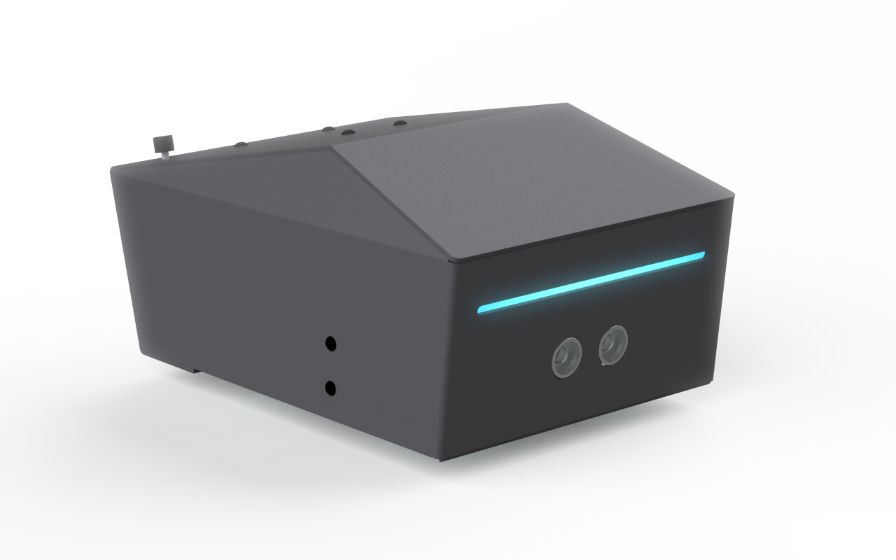

# Arduino Library for MiniSobot

## Introduction
MiniSobot is designed to facilitate first contact with robotics.  Its aim is to stimulate active learning so that users can explore technical concepts and expand their ability to solve problems by interacting with different technological systems.

It is fully compatible with the Arduino platform, has an integrated library for speed control during movement, programmable light and sound signaling, and reads the sensors available on the robot.

This product was developed 100% by Solis Tecnologia and has the technologies needed to explore the world of robotics.

## Components
- Main structure in aluminum
- Robot Control Driver Compatible with Arduino 
- 2x Motor DC 4-6V 
- 6-12V battery
- Push-button
- Buzzer (Piezo)
- LED RGB
- 2x Sensor Photoeletric
- Sensor Ultrassonic

## Connection Table
| Inputs Arduino | Peripheral    | 
|----------------|---------------|
| D0             | nda           |
| D1             | nda           |
| D2             | nda           |
| D3             | LED_BLUE      |
| D4             | nda           |
| D5             | LED_RED       |
| D6             | LED_GREEN     |
| D7             | MOTOR2_IN1    |
| D8             | MOTOR2_IN2    |
| D9             | MOTOR2_PWM    |
| D10            | BUZZER        |
| D11            | MOTOR1_PWM    |
| D12            | MOTOR1_IN1    |
| D13            | MOTOR1_IN2    |
| D14            | FOTO_E2       |
| D15            | FOTO_E1       |
| D16            | SONAR_ECHO    |
| D17            | SONAR_TRIGGER |
| D18            | BUTTON_CTRL   |
| D19            | nda           |

---
## API DOCUMENTATION

### MiniSobot
#### Description

Creates a variable of type MiniSobot. If the assembly is equals instruction guide, just calls the variable. If you have changes, set its value according to the change.

#### Syntax
~~~cpp
MiniSobot robot;

// Sequence Default of Assembly
MiniSobot robot (led_blue_pin, led_red_pin, led_green_pin, motor2_in1_pin, motor2_in2_pin, motor2_pwm_pin, buzzer_pin, 
motor1_in1_pin, motor1_in2_pin, motor1_pwm_pin, foto_e2_pin, foto_e1_pin, sonar_echo_pin, sonar_trigger_pin, button_pin );
~~~
#### Parameters

 - led_red_pin, led_green_pin, led_blue_pin: the numbers of the Arduino pin that is connected to the LED RGB pin. 

- motor1_in1_pin; motor1_in2_pin, motor1_pwm_pin: the numbers of the Arduino pin that is connected to the Motor 1 pins. OBS: The motor 2 stay in left 

- motor2_in1_pin, motor2_in2_pin, motor2_pwm_pin: the numbers of the Arduino pin that is connected to the Motor 2 pins. OBS: The motor 2 stay in right 

- buzzer_pin: the number of the Arduino pin that is connected to the Buzzer Piezo pin. 

- foto_e2_pin, foto_e1_pin: the numbers of the Arduino pin that is connected to the Follow Line Sensors pins. OBS: Foto e1 is left and Foto e2 is right

- sonar_echo_pin, sonar_trigger_pin: the numbers of the Arduino pin that is connected to the Ultrassonic Sensor pins. 

- button_pin:  the number of the Arduino pin that is connected to the Button pin. 

#### Example

~~~cpp

 #include <Arduino.h>
 #include "MiniSobot.h"

MiniSobot robot; 

// Default Assembly
// MiniSobot robot (3, 5, 6, 7, 8, 9, 10, 11, 12, 13, 14, 15, 16, 17, 18);

void setup(){

  // Insert your code

}
void loop (){

  // Insert your code

}
~~~

### drive_forward()

#### Description

Drive in forward, at speed and duration defined by parameter, the range of speed values go 0 to 255, but values below 100 not are recommended. If you not set the speed parameter, default values are be used (255) and  if the duration is not set, the robot will moves forward forever.

#### Syntax

~~~cpp 
robot.drive_forward(speed, duration);
robot.drive_forward(speed);
robot.drive_forward();
~~~

#### Parameters
- robot - a variable of type MiniSobot
- speed (optional) - speed of MiniSobot move - range is 0 to 255, but values below 100 not are recommended, default: 255
- duration (optional) - duration that will moves 
#### Example

~~~cpp
 #include "MiniSobot.h"

MiniSobot robot;

void setup(){}

void loop (){
  robot.drive_forward(200);
}
~~~
---

### drive_backward()

#### Description

Drive in backward, at speed and duration defined by parameter, the range of speed values go 0 to 255, but values below 100 not are recommended. If you not set the speed parameter, default values are be used (255) and  if the duration is not set, the robot will moves forward forever.

#### Syntax

~~~cpp 
robot.drive_backward(speed, duration);
robot.drive_backward(speed);
robot.drive_backward();
~~~

#### Parameters
- robot - a variable of type MiniSobot
- speed (optional) - speed of MiniSobot move - range is 0 to 255, but values below 100 not are recommended, default: 255
- duration (optional) - duration that will moves 
#### Example

~~~cpp
 #include "MiniSobot.h"

MiniSobot robot;

void setup(){}

void loop (){
  robot.drive_backward(200);
}
~~~
---

### drive_break()

#### Description
Stops motors by setting both input pins high. It is recommended use this function whenever  changing the direction of the motor and use a small delay between commands, this will reduce de current peak and not damage the motor

#### Syntax
~~~cpp
robot.drive_break()
~~~

#### Parameters
- robot - a variable of type MiniSobot

#### Example
~~~cpp
 #include "MiniSobot.h"

MiniSobot robot;

void setup(){}

void loop (){

  robot.drive_forward(200);
  delay(2000);

  robot.drive_break();
  delay(2000);

  robot.drive_backward(200);
  delay(2000);

  robot.drive_break();
  delay(2000);
}
~~~
---

### drive_curve_right()

#### Description
Make a turn to the RIGHT, in the same axis, speed is defined by parameter, the range of values go 0 to 255, but values below 100 not are recommended. If you not set the speed parameter, default values are be used (255).
    
#### Syntax
~~~cpp
robot.drive_curve_right(int speed);
~~~

#### Parameters
- robot - a variable of type MiniSobot
- speed (optional) - speed of MiniSobot move - range is 0 to 255, but values below 100 not are recommended, default: 255

#### Example
~~~cpp
 #include "MiniSobot.h"

MiniSobot robot;

void setup(){}

void loop (){

  robot.drive_curve_right(200);

}
~~~

---

### drive_curve_left()

#### Description
Make a turn to the LEFT, in the same axis, speed is defined by parameter, the range of values go 0 to 255, but values below 100 not are recommended. If you not set the speed parameter, default values are be used (255).
    
#### Syntax
~~~cpp
robot.drive_curve_left(int speed);
~~~

#### Parameters
- robot - a variable of type MiniSobot
- speed (optional) - speed of MiniSobot move - range is 0 to 255, but values below 100 not are recommended, default: 255
#### Example
~~~cpp
 #include "MiniSobot.h"

MiniSobot robot;

void setup(){}

void loop (){

  robot.drive_curve_left(200);
  
}
~~~
---

### drive_curve_differential_left()

#### Description

Make a turn to the LEFT, use differential drive, speed is defined by parameter, the range of values go 0 to 255, but values below 100 not are recommended. If you not set the speed parameter, default values are be used (255). Also have "percent" parameter this defined a speed percent referent a motor2. Eg: drive_curve_differential_left(255, 50)  ->  Motor2 Speed: 255 | Motor1 Speed: 255*50% = 127
    

#### Syntax
~~~cpp
robot.drive_curve_differential_left(speed, percent);
~~~

#### Parameters
- robot - a variable of type MiniSobot
- speed (optional) - speed of MiniSobot move - range is 0 to 255, but values below 100 not are recommended, default: 255
- percent - Speed percent referent a motor2. Range is 0 to 100. The lower the value, the smaller the curve angle.

#### Example
~~~cpp
 #include "MiniSobot.h"

MiniSobot robot;

void setup(){}

void loop (){

    robot.drive_curve_differential_left(200, 50);
  
}
~~~
---

### drive_curve_differential_right()

#### Description

Make a turn to the RIGHT, use differential drive, speed is defined by parameter, the range of values go 0 to 255, but values below 100 not are recommended. If you not set the speed parameter, default values are be used (255). Also have "percent" parameter this defined a speed percent referent a motor1. Eg: drive_curve_differential_right(255, 50)  ->  Motor1 Speed: 255 | Motor2 Speed: 255*50% = 127
    

#### Syntax
~~~cpp
robot.drive_curve_differential_right(speed, percent);
~~~

#### Parameters
- robot - a variable of type MiniSobot
- speed (optional) - speed of MiniSobot move - range is 0 to 255, but values below 100 not are recommended, default: 255
- percent - Speed percent referent a motor1. Range is 0 to 100. The lower the value, the smaller the curve angle.

#### Example
~~~cpp
 #include "MiniSobot.h"

MiniSobot robot;

void setup(){}

void loop (){

    robot.drive_curve_differential_right(200, 50);
  
}
~~~

---

### led_rgb()
#### Description

Control the color of led rgb, You can set different intensites and  make various effects Eg: FadeOut, Flash and Blink. Sets the values from 0 to 255 for each of the three colors. Or disable the led with the "disable" parameter if set 1.

#### Syntax
~~~cpp
robot.led_rgb(red, green, blue, disable);
~~~

#### Parameters
- robot - a variable of type MiniSobot
- red - set the color red of LED (0 to 255)
- green - set the color green of LED (0 to 255)
- blue - set the color blue of LED (0 to 255)
- disable (optional) - disable LED (1 Disable | 0 Enable);  

#### Example
~~~cpp
 #include <Arduino.h>
 #include "MiniSobot.h"

Minisobot robot;

void setup(){

}
void loop (){
  robot.led_rgb(255,0,0);
  delay(1000);

  robot.led_rgb(0,255,0);
  delay(1000);

  robot.led_rgb(0,0,255);
  delay(1000);
}
~~~

---

### buzzer()
#### Description

Play a specific tone in buzzer present in MiniSobot. Do you define the frequency with parameter and duration of this tone. If the time is not set, the tone will play forever.

Consult the table for frequency of muscial notes to set a correct tone note. 
#### Syntax
~~~cpp
robot.buzzer(frequency, duration);
~~~

#### Parameters
- robot - a variable of type MiniSobot
- frequency - set the frequency of buzzer;
- duration (optional): duration of tone frequency 

#### Example
~~~cpp
 #include "MiniSobot.h"

MiniSobot robot;

void setup(){
    
}

void loop (){

    int time = 500;
    robot.buzzer(262,time); 
    robot.buzzer(294,time);
    robot.buzzer(330,time);
    robot.buzzer(349,time);
    robot.buzzer(392,time);
    robot.buzzer(440,time);
    robot.buzzer(494,time);
    robot.buzzer(528,time);
    delay(1000);
}
~~~
---

### read_button()

#### Description
Read data from push-button, are returned a int data. The button has a pull_up, then when the button are pressed the values returned is 1, when not pressed returned 0. It's commonly used to start programming.

#### Syntax
~~~
isPressed = robot.read_button()
~~~
#### Parameters
- IsPressed - a variable to store reading data (int)
- robot - a variable of type MiniSobot

#### Example
~~~cpp
 #include "MiniSobot.h"
MiniSobot robot;

void setup(){
}

void loop (){

  if (robot.read_button()) 
  {
      robot.led_rgb(0,255,0);
  }
  else{
      robot.led_rgb(255,0,0);
  }
}
~~~
---

### read_line()
#### Description
 Read data from sensor photoelectric, defined which sensor with parameter "Sensor". In MiniSobot has 2 two sensor, one in left (1) and another in right (2), with them do you can follow lines and identify different superfaces. 

#### Syntax
~~~
isLine = robot.read_line(sensor)
~~~

#### Parameters
- IsLine - a variable to store data 
- robot - a variable of type MiniSobot
- sensor - wich sensor use, 1-Left | 2-Right

#### Example

~~~cpp
 #include "MiniSobot.h"
MiniSobot robot;

int flag_sensor_line_right = 2; 
int flag_sensor_line_left = 2; 
int right, left;

void setup(){

}

void loop (){

    right = robot.read_line(1);
    left = robot.read_line(2);

    if ((flag_sensor_line_left != left)||(flag_sensor_line_right != right)){
        robot.led_rgb(0,0,255);

        if (right == 0 && left == 0){
            robot.drive_forward(150);  
            }

        else if (right == 1 && left == 0){
            robot.drive_curve_differential_right(150, 30); 
        }

        else if (right == 0 && left == 1){
            robot.drive_curve_differential_left(150, 30); 
        }

        flag_sensor_line_right = right;
        flag_sensor_line_left = left;
    }
}
~~~

---

### read_ultrassonic ()
#### Description
Read data from sensor ultrasonic, this sensor using the ultrassonic effect for calculate distance of things. The function returne a float data. The distance are measured in Centimeter(CM), datas below 2 cm and upper 400 cm not are confiables.

#### Syntax
~~~cpp
distance = robot.read_ultrassonic();
~~~
#### Parameters

- distance - a variable to store distance data (in CM)
- robot - a variable of type MiniSobot

#### Example
~~~cpp
  #include <Arduino.h>
  #include "MiniSobot.h"

MiniSobot robot;

void setup(){
Serial.begin(9600);
}

void loop (){

    float distance = 0;
    distance = robot.read_ultrasonic();

    Serial.print("The Distance in CM: ");
    Serial.println(distance);
    delay(1000);
}
~~~

## Reference Link
[Solis Tecnologia Website](https://solistecnologia.com/produtos/robotsingle)

## Please Contact Us
If you have any problem when using our robot after checking this tutorial, please contact us.

### Phone:
+55 11 3237-2222

### Technical support email: 
contato@solistecnologia.com.br

